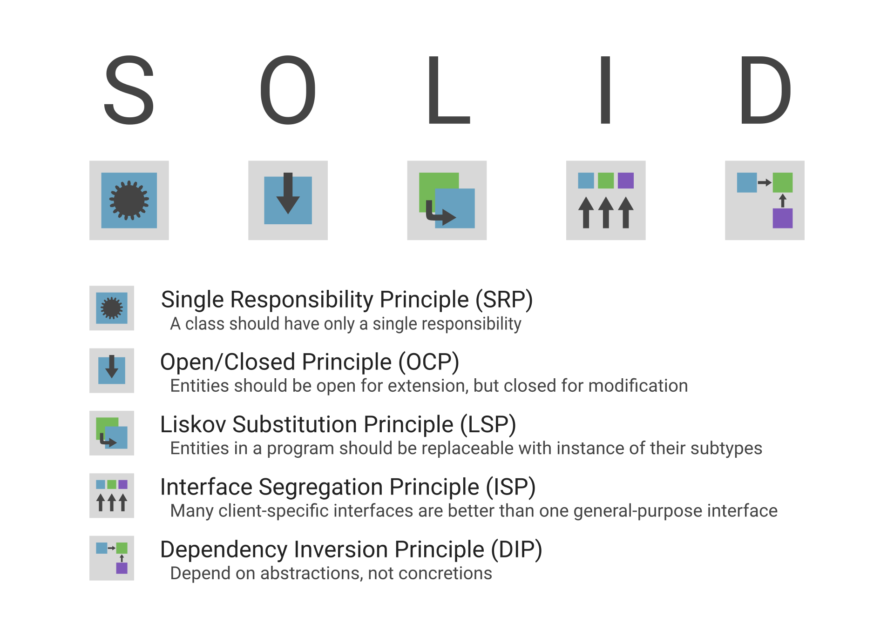
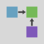

# SOLID Poster

Just a poster with the summary of each of the SOLID principles.

The original vector images are in the `source/` directory and the generated
raster images are in the `images/` directory.

Icons are generated in the sizes of `2^5` to `2^10`.

## Poster

## Icons

 Single Responsibility Principle (SRP)

 Open/Closed Principle (OCP)

 Liskov Substitution Principle (LSP)

 Integration Segregation Principle (ISP)

 Dependency Inversion Principle (DIP)

## Development

Inkscape is required for generating raster images from the command-line.
Any SVG editor can be used to edit the images under the `source/` directory.

1. Clone the project
2. Run `bundle install` to install development dependencies
3. Build the raster images
  * Run `bin/guard` to watch the project directory for changes and generate raster images when vector images are saved
  * Run `bin/rake` to generate all raster images

## Contributing

Bug reports and pull requests are welcome on GitHub at https://github.com/RyanScottLewis/solid_poster. This project is intended
to be a safe, welcoming space for collaboration, and contributors are expected to adhere to the [Contributor
Covenant](http://contributor-covenant.org) code of conduct.

## License

The gem is available as open source under the terms of the [MIT License](http://opensource.org/licenses/MIT).
